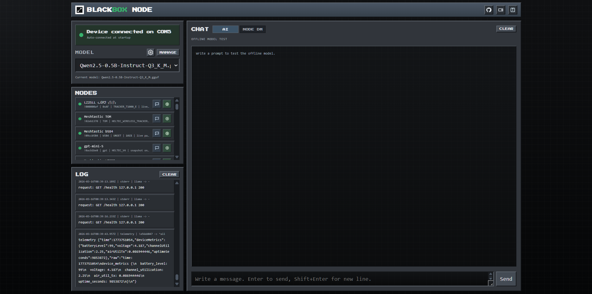
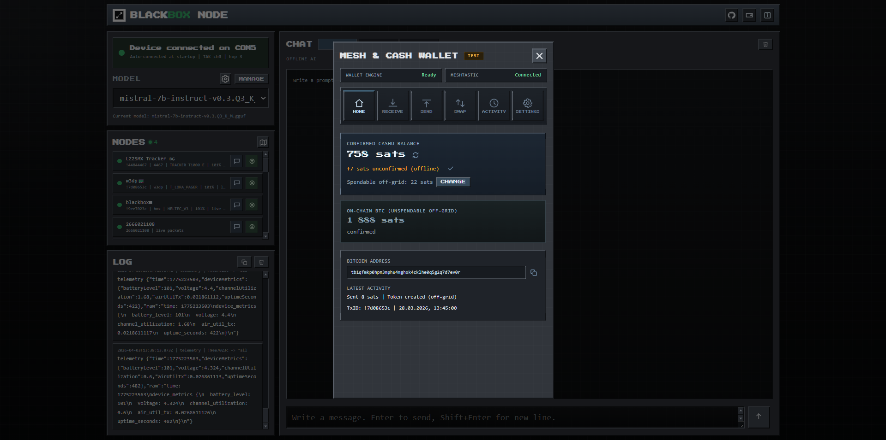
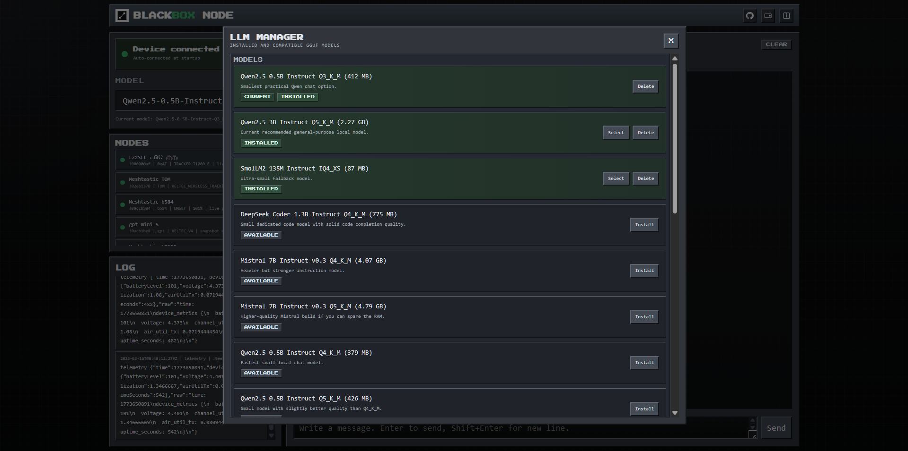

# BLACKBOX NODE - Offline AI, Meshtastic, TAK / ATAK, and Off-Grid Payments

> **Built for when the internet is gone.**

Website: [blackbox.host](https://blackbox.host/)

Blackbox Node is an offline-first command post for [Meshtastic](https://meshtastic.org/) and **LoRa** networks. It combines a fully local LLM, radio messaging, **TAK / ATAK** map-object exchange over **Cursor on Target (CoT)**, telemetry, and **Bitcoin + Cashu** payments in one self-hosted web UI.

It is designed for **off-grid communications**, **disaster response**, **field operations**, **community mesh networks**, and anyone who wants local AI and situational awareness without cloud infrastructure, without a cell tower, and without a remote server.

---

## Demo

[](https://www.youtube.com/watch?v=R8iXfAWsvDg)

---

## Why people use Blackbox Node

- Run a local offline AI assistant on your own machine with `llama.cpp`
- Turn a laptop plus Meshtastic radio into a resilient **LoRa mesh node**
- Send and receive **TAK / ATAK / CoT** map objects over the mesh
- Keep chat, telemetry, and node awareness working during outages
- Move value off-grid with **Bitcoin** and **Cashu ecash**
- Store everything locally in `./data/` with no accounts and no hosted backend

---

## What is Meshtastic and LoRa?

[Meshtastic](https://meshtastic.org/) is a free, open-source project that lets inexpensive hardware form a decentralized mesh radio network. Nodes communicate directly over radio and route messages hop by hop without internet or cellular infrastructure.

The radios use **LoRa** (Long Range), a spread-spectrum radio modulation that can reach roughly **5-15+ km** in open terrain. Every node is both a receiver and a repeater, so the network becomes more resilient as more nodes join.

Popular hardware you can use with Meshtastic:
- [Heltec LoRa 32](https://heltec.org/project/wifi-lora-32-v3/) - compact ESP32-based starter board
- [LILYGO T-Beam](https://www.lilygo.cc/products/t-beam-v1-1-esp32-lora) - built-in GPS and battery management
- [RAK WisBlock](https://store.rakwireless.com/collections/wisblock-core) - modular and highly configurable
- [Seeed SenseCAP T1000](https://www.seeedstudio.com/SenseCAP-Card-Tracker-T1000-A-p-5697.html) - compact tracker-style form factor

These devices typically cost about $20-$60 and can run for days on a small battery or indefinitely on solar.

---

## What Blackbox Node does

### Local offline AI

Runs a quantized LLM entirely on your machine via `llama.cpp`. No API keys, no cloud calls, and no internet required during normal operation. You can load small GGUF models for weak hardware or larger models for better responses.

### AI over the mesh

Other Meshtastic nodes in range can query your AI by radio. Send `@bot your question` or `!ask your question` from any Meshtastic device and the response comes back over the air.

### TAK / ATAK / Cursor on Target (CoT)

Blackbox Node includes a dedicated **TAK layer workflow** for Meshtastic-backed map exchange:

- send **waypoints, circles, and range/bearing lines** from the map
- receive incoming **CoT XML** over the mesh and render supported features such as markers, routes, polygons, circles, ellipses, and rectangles
- delete previously shared TAK objects with generated CoT delete events
- configure **TAK channel** and **TAK hop limit** per device
- automatically switch large CoT payloads to **fountain transfer** for lossy mesh links
- save incoming captures to `data/tak_capture/` for debugging and replay

This makes the project relevant not just for hobby mesh chat, but also for **ATAK-adjacent field mapping**, **team awareness**, and **situational awareness on disconnected networks**.


### Communication and telemetry

All inbound and outbound Meshtastic messages are tracked in the web UI. Node positions, telemetry, battery levels, and environment readings are recorded and browsable. Direct messages and channel broadcasts are both supported.



### Off-grid payments

Blackbox Node includes a built-in **Bitcoin wallet** (on-chain, BIP-39/HD) and a **Cashu ecash wallet** for Lightning-compatible off-grid transactions.

[Cashu](https://cashu.space) tokens are bearer instruments that can be copied and pasted like text, so payments can move over Meshtastic radio as plain messages. When connectivity returns, tokens can be melted back to Lightning or held as ecash.

This makes it possible to run basic economic activity such as tipping, paying for services, and splitting resources entirely over a radio mesh network.



---

## Typical use cases

- Off-grid community infrastructure
- Disaster communications and blackout fallback
- Field teams using Meshtastic plus TAK-style map sharing
- Rural or expedition deployments with no reliable internet
- Local-first AI nodes for neighborhoods, events, vehicles, or camps

---

## Two modes

| Mode | What it needs |
|---|---|
| **Local offline AI only** | A machine running Node.js and Python, plus a GGUF model file. No radio and no internet during runtime. |
| **Full off-grid mesh node** | Same as above, plus a Meshtastic device connected by USB serial. |

The app starts in whatever mode it can. Radio, TAK, and mesh features stay inactive until a device is found.

---

## Installation

### Fast path

```bat
npm install
npm start
```

During `npm install`, the project bootstraps the local AI runtime automatically:

- installs JavaScript dependencies
- downloads a platform-matched `llama.cpp` runtime into `./llama/` if missing (Windows/Linux/macOS)
- downloads a starter GGUF model into `./models/` if missing
- attempts to install the Meshtastic Python package into `./pydeps/` if Python is available

That is enough for the web UI and local AI to start on a clean machine.

### 1. Prerequisites

Install these before anything else:

- **[Node.js 18+](https://nodejs.org/)** - main runtime
- **[Python 3.11+](https://www.python.org/downloads/)** - Meshtastic radio bridge and TAK transport logic

Verify both are available:

```bat
node --version
python --version
```

### 2. Clone and install Node dependencies

```bat
git clone https://github.com/wadadawadada/blackbox_node.git
cd blackbox_node
npm install
```

This creates `node_modules/` and runs the bootstrap installer for the local AI runtime.

### 3. Set up `llama.cpp` (manual fallback only)

Skip this step unless automatic bootstrap failed or you want to replace the runtime manually.

Otherwise, the `llama/` folder must contain `llama-server` (`llama-server.exe` on Windows) and the companion runtime libraries from a matching prebuilt package in the [llama.cpp releases page](https://github.com/ggerganov/llama.cpp/releases).

Extract `llama-server` (or `llama-server.exe`) and the bundled `ggml`/`llama` runtime libraries into `./llama/`:

```text
llama/
  llama-server(.exe)
  llama runtime libraries (.dll / .so / .dylib depending on OS)
```

Pick the build that matches your machine and OS/CPU:

- No GPU -> `...-cpu-...`
- NVIDIA GPU -> `...-cuda-...`
- AMD / Intel GPU -> `...-vulkan-...`
- Apple Silicon (optional acceleration) -> `...-metal-...`

### 4. Download a model (manual fallback only)

Skip this step unless automatic bootstrap failed or you want to add more models manually.

Otherwise, create the `models/` folder and download at least one `.gguf` model file into it.

**Option A - use the built-in model manager**
1. Run `npm start`
2. Open `http://127.0.0.1:7860`
3. Go to **Settings -> Models** and click **Install** next to any model



**Option B - download manually**

```bat
mkdir models
```

Then place any `.gguf` file into `models/`. Recommended starter: `Qwen2.5-3B-Instruct-Q5_K_M.gguf` (~2.3 GB).

### 5. (Optional) Connect a Meshtastic device

Plug in your Meshtastic device via USB before starting. The app auto-detects serial ports and installs Python dependencies automatically on first connect.

No device? The app still starts fine. Mesh, telemetry, and TAK features just show as disconnected.

---

## TAK quick start

1. Connect a Meshtastic device and start the app with `npm start`.
2. Open `http://127.0.0.1:7860`.
3. In **Device Identity**, set **TAK Channel** and **TAK Hop Limit** if needed.
4. Open the map, toggle the **TAK** panel, and create a waypoint, circle, or ruler overlay.
5. Send it over the mesh. Large CoT payloads will automatically use fountain transfer.
6. Incoming supported CoT objects are parsed and rendered on the map, and captures are saved under `data/tak_capture/`.

---

## Quick start

```bat
npm install
npm start
```

On launch:

- the web UI opens at `http://127.0.0.1:7860`
- `llama-server` (or `llama-server.exe` on Windows) starts and loads the selected model
- the Python Meshtastic bridge (`bridge.py`) connects to a detected serial device
- the installer prepares `./llama/`, `./models/`, and tries to prepare `./pydeps/`

---

## Requirements

| Requirement | Notes |
|---|---|
| Node.js 18+ | Runtime for the web server |
| Python 3.11+ | Required only for Meshtastic radio and TAK features |
| Internet during `npm install` | Needed to download `llama.cpp`, a starter model, and optional Python deps |
| `./llama/llama-server` (or `llama-server.exe` on Windows) | Auto-downloaded on install if missing |
| At least one `.gguf` in `./models/` | Auto-downloaded on install if missing |
| Meshtastic device on USB serial | Optional, but required for radio, telemetry, and TAK transport |

---

## Features

**AI**

- Local LLM via `llama.cpp`, fully offline after model download
- Mesh-triggered queries with `@bot ...` and `!ask ...`
- `!reset` clears per-peer conversation context
- Configurable system prompt, temperature, top-p, and token limits per mode
- Built-in model manager for curated GGUF downloads

**Meshtastic / Radio**

- Auto-detects Meshtastic serial devices on startup
- Inbound message log and node list with telemetry, battery, SNR, position, and environment
- Node detail view with raw packet data
- Weather and environment parsing from telemetry and text broadcasts
- `nodes` / `list nodes` query returns a compact node list over the mesh
- `weather` / `forecast` query returns the latest parsed weather data
- Reconnect and port-selection UI

**TAK / ATAK / CoT**

- Dedicated TAK layer panel in the web map
- Send CoT objects over Meshtastic from the web map: waypoint, circle, and ruler overlays
- Parse and render incoming CoT XML from the mesh
- Render richer inbound CoT geometry including routes, polygons, ellipses, and rectangles
- CoT delete-event generation for removing shared objects
- Per-device TAK channel and hop-limit settings
- Fountain-coded transfer path for large CoT payloads
- Debug capture output under `data/tak_capture/` and `data/tak_plugin_debug/`

**Payments**

- Bitcoin HD wallet (BIP-39, on-chain receive)
- Cashu ecash wallet: set a mint, receive/send tokens, melt to Lightning
- Cashu tokens are plain text, transferable over radio or any other text channel
- Lightning invoice payment via Cashu melt
- QR code generation for Bitcoin addresses and Lightning invoices
- Transaction history

**UI and storage**

- Local web UI for message log, node list, map, TAK layers, local chat, wallet, and settings
- All data stored locally in `./data/`
- No external database, no accounts, no telemetry

---

## Defaults

| Setting | Value |
|---|---|
| Web UI | `http://127.0.0.1:7860` |
| LLM backend | `http://127.0.0.1:8080` |
| Starter model installed by bootstrap | `Qwen2.5-0.5B-Instruct-Q3_K_M.gguf` |
| Default model | `Qwen2.5-0.5B-Instruct-Q3_K_M.gguf` |
| Default TAK channel | `0` |
| Default TAK hop limit | `3` |

---

## Notes

- The app runs without a radio. Meshtastic, TAK, and mesh features simply show as disconnected.
- If Python is missing, the web UI and local AI still work, but Meshtastic and TAK transport features stay unavailable.
- Automatic bootstrap currently targets Windows for `llama.cpp` runtime download.
- Downloading models or auto-installing Python packages requires internet during `npm install`. Runtime is otherwise fully local.
- Cashu token operations usually require internet access to reach the mint. Tokens already in your wallet can still be held and transferred offline, but creating a new send offline only works when your existing proofs already match the exact amount; otherwise the wallet must contact the mint to split/change proofs.
- Current bridge support is strongest for **CoT XML / `ATAK_FORWARDER`** traffic. Raw `ATAK_PLUGIN` protobuf payloads are captured for debugging, but are not fully decoded by the bridge yet.

---

## Donate

If this project is useful to you, consider supporting development:

Sponsor on GitHub: [github.com/sponsors/wadadawadada](https://github.com/sponsors/wadadawadada)

| Chain | Address |
|---|---|
| BTC | `bc1p3p87l267hte2dgg60jjt7w9xk8vfcjenr534yya0hedhet4l4fvq2x2svp` |
| XMR | `44QwjAWN4wR8KNqALAfcnjSMhb1Yj7AKCVCBMJFuzr6N8WYW23cDQNd3RiSvMEX2dyUQ5z6pP8sJ2YcmJXS4SLkc24E5SJM` |
| ETH | `0xaA01e4F453d5ae9903EebeABA803f3388D20d024` |
| SOL | `4xgvfwv3TTt1SnavP5okbjBBsfRmoLpdeQKXguVdXheF` |
